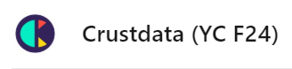

<div align="center">
  <a href="https://crustdata.com/">
    
    <h1 align="center">AI API Support Agent for Crustdata</h1>
  </a>
</div>

<p align="center">
  AI Customer support chatbot that answers questions about the Crustdata API. Try it out at- https://crustdata-chatbot-ratish.vercel.app/
</p>

<p align="center">
  <a href="#about"><strong>About</strong></a> ·
  <a href="#how-to-use"><strong>How to Use</strong></a> ·
  <a href="#ai-usage-and-rag"><strong>AI Usage and RAG</strong></a> ·
  <a href="#features"><strong>Features</strong></a> ·
  <a href="#model-providers"><strong>Model Providers</strong></a> ·
  <a href="#running-locally"><strong>Running locally</strong></a> ·
</p>
<br/>

## About 

This is a webapp built for the Crustdata Build challenge (https://www.linkedin.com/feed/update/urn:li:activity:7281490942816071680/). A RAG system on the [Crustdata API docs](https://crustdata.notion.site/Crustdata-Discovery-And-Enrichment-API-c66d5236e8ea40df8af114f6d447ab48#53274edf0e9442d1a64091b213d689c2) enables contextual question answering. Free tier Google models are used both for the chat AI model client (Gemini Flash) as well as for embeddings generation (Text Embeddings). Supabase is used as the Vector store for the Crustdata API doc embeddings. 

Credits: This webapp is built on top of an official Open-Source AI Chatbot Template Built With Next.js and the AI SDK by Vercel- https://github.com/vercel-labs/gemini-chatbot/tree/main. 

## How to Use 

Go to the live demo at https://crustdata-chatbot-ratish.vercel.app/ and sign up with an email and password (this is necessary to store your previous chats with the Crustdata support agent). Sign in if you have already signed up. 

Then ask away about your Crustdata API questions. You may ask follow up questions too. 

You can also start a new chat, go to old saved chats or delete old chats by opening the sidebar. 

## AI Usage and RAG

Retrieval Augmented Generation (RAG) is used by this support AI. Crustdata API docs were chunked by endpoint (`chunks/`) into .txt files, and embeddings created on API endpoint overviews in `scripts/index_data.ts` (a standalone script executed only once to create the embeddings vector database for later RAG) and ingested into a Supabase vector database. 

An internal LLM generation step is used to condense the latest question sent by the user in the chat interface and chat history into a standalone question for meaningful RAG querying. A Vercel serverless function is used for this and all the steps mentioned here are at `app/(chat)/api/chat/route.ts`. The Supabase vector database is then queried and the relevant documents are loaded as context. The Crustdata [data dictionary](https://crustdata.notion.site/Crustdata-Data-Dictionary-c265aa415fda41cb871090cbf7275922) is also hard coded into the prompts for each call so that the AI model can comprehend what it receives as context. 

Finally, the model's responses are then streamed back to the user to answer their queries and provide support. 

## Model Providers

This web app uses Google's Gemini Flash Model to answer Crustdata API questions. Relevant API documentation chunks are retrieved based on embeddings created by Google's Text Embedding 004 model. 

## Running locally

You will need to use the environment variables [defined in `.env.example`](.env.example) to run Next.js AI Chatbot. It's recommended you use [Vercel Environment Variables](https://vercel.com/docs/projects/environment-variables) for this, but a `.env` file is all that is necessary.

> Note: You should not commit your `.env` file or it will expose secrets that will allow others to control access to your various Google Cloud and authentication provider accounts.

1. Install Vercel CLI: `npm i -g vercel`
2. Link local instance with Vercel and GitHub accounts (creates `.vercel` directory): `vercel link`
3. Download your environment variables: `vercel env pull`

```bash
pnpm install
pnpm dev
```

Your app template should now be running on [localhost:3000](http://localhost:3000/).
